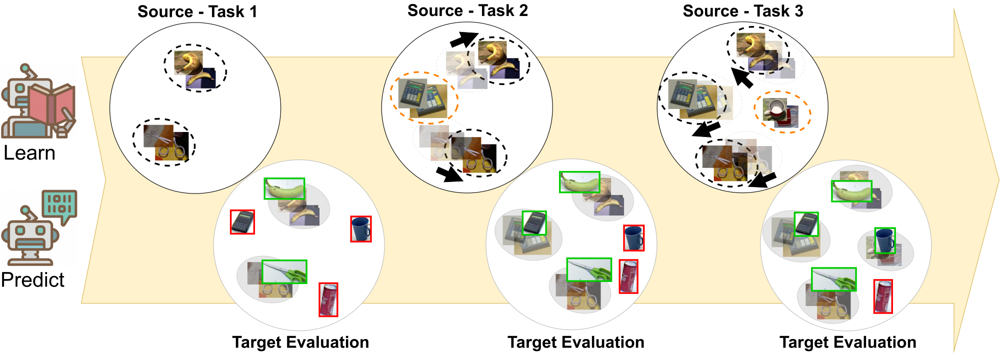

# Contrastive Learning for Cross-Domain Open World Recognition



## 1. Requirements

### Packages

You can install required packages via pip: 

```bash
pip install -r requirements.txt
```

The last dependency is `torchlars` which has to be installed after the others:

```bash
pip install torchlars
```

### Datasets 

Data should be placed under `~/data/`.

#### ROD, synROD, ARID

Follow [OWR Visualdomains benchmark](https://github.com/DarioFontanel/OWR-VisualDomains)
instructions for datasets preparation. 

#### COSDA-HR

Download data from the [official site](https://nlab-mpg.github.io/COSDA-HR/) and untar it. 

#### CORe50 

Download data from the [official site](https://vlomonaco.github.io/core50/). You will need the 'cropped_128x128_images.zip' file. 

## 2. Training

We perform training on a single GPU. 

The basic training command for ROD:

```bash
python train.py --dataset OWR --source ROD --dataorder 0
```

The `dataorder` param is necessary to choose one of the 5 available class orders for incremental
learning. The training output is stored in `logs/OWR_ROD_do_0/`

To train on synROD: 

```bash
python train.py --dataset OWR --source synROD --dataorder 0
```

To train on COSDA-HR:

```bash 
python train.py --dataset COSDA-HR --dataorder 0
```

To train on CORe50: 

```bash 
python train.py --dataset CORe50 --dataorder 0
```


## 3. Evaluation

To perform an eval on a single experiment and episode one can use the `eval.py` script:

```bash
python eval.py --source ROD --target arid --load_path logs/OWR_ROD_0/episode_0.model --mode OWR_eval --eval_episode 0 --dataorder 0
```

After performing a complete training for all 5 class orders for a given dataset one can also test
all models together.

For OWR datasets:

```
python eval_OWR.py ROD arid logs/OWR_ROD
```

The listed paramerts represent in order: "source", "target" and "train output path". Note that the output path should not
include the suffix `_do_*` as it is automatically added by the eval script.

Similarly to test a complete COSDA-HR experiment: 

```bash 
python eval_COSDA.py logs/COSDA_source
```

And for CORe50:
```bash 
python eval_CORe50.py logs/CORe50_source
```
